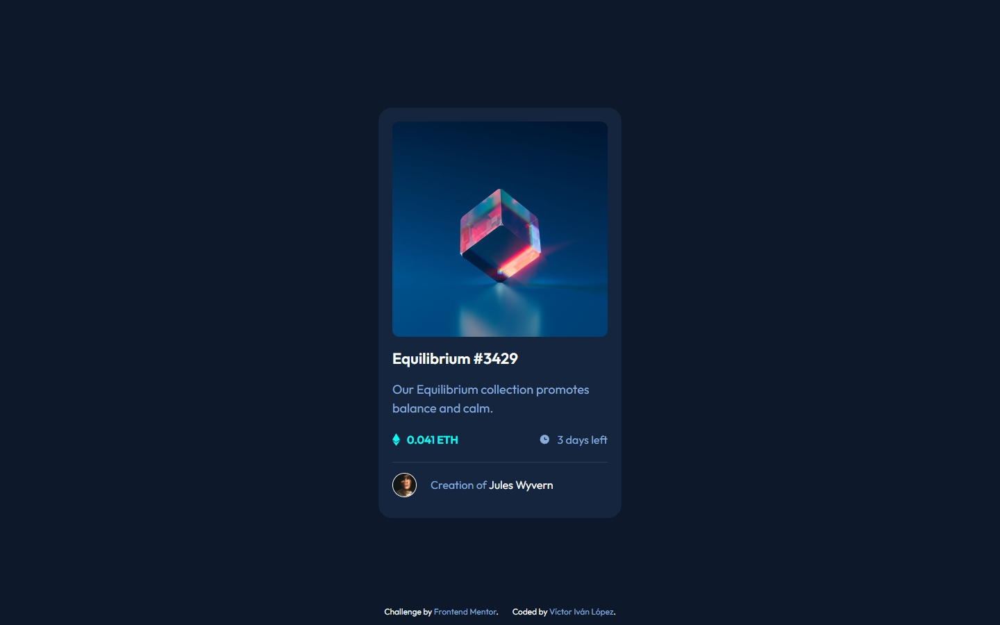

# Frontend Mentor - NFT preview card component solution

This is a solution to the [NFT preview card component challenge on Frontend Mentor](https://www.frontendmentor.io/challenges/nft-preview-card-component-SbdUL_w0U). Frontend Mentor challenges help you improve your coding skills by building realistic projects. 

## Table of contents

- [Overview](#overview)
  - [Screenshot](#screenshot)
  - [Links](#links)
  - [Built with](#built-with)
- [Author](#author)

## Overview

### Screenshot

### Links

- Solution URL: [victorivanlopezlearning](https://www.frontendmentor.io/solutionsnft-preview-card-component-vanilla-css-bem-mQxAbxU4LF)
- Live Site URL: [victorivanlopez/nft-card-component](https://victorivanlopezlearning.github.io/nft-card-component/)

### Built with

- Semantic HTML5 markup
- CSS custom properties
- Flexbox
- CSS Grid
- Mobile-first workflow
- Methodology BEM

## Author

- Frontend Mentor - [@victorivanlopezlearning](https://www.frontendmentor.io/profile/victorivanlopezlearning)